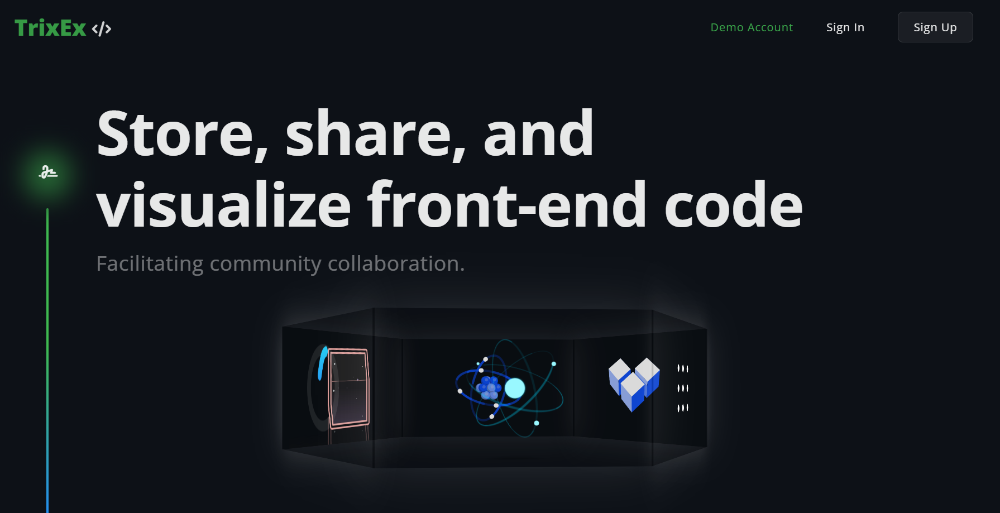



## About TrixEx

Store, share, and visualize front-end code. <a href="http://3.133.92.255/TrixEx.com" target="_blank">TrixEx</a> allows developers to exchange front-end components. Sign into <a href="http://3.133.92.255/TrixEx.com" target="_blank">TrixEx</a> with a demo account for full access to the site in a single click.

### <a href="http://3.133.92.255/TrixEx.com" target="_blank">TrixEx.com</a>

## Tech Stack

       

## Overview

* Employed the Django framework for the development of HTTP route handling, object-relational mapping, OOP,
session management, AJAX request, JSON response, user-role-based authorization, and user authentication.
* Optimized deployment on AWS(EC2) coupled with Nginx server for rapid spin-up time & cost-effective deployment.
* Adhered to the MVC design pattern, for a well-structured separation of concerns through modularization.

## Features Walkthrough

#### Security

🔒 User Authentication & Authorization
* Password ***hashing***
* Registration ***validation***
* Route protection

---

 

To ***create*** a project, paste your HTML, CSS, and JS into the browser and watch your component come to life in real time.
* Set the project to ***private*** and it will only be visible to the creator.
* Set the project to ***public*** for the whole TrixEx community to see. 

---

 

Viewing someone's component will show the code for it. If you like their work you can view their ***profile page*** and it will display their other public projects. 

***Follow*** users to show your support and keep track of components that interest you with the ***favorite*** button.

* One to many relationship with users and projects
* Many to many relationship with users and ***followers***
* Many to many relationship with users and ***favorites***

---

 

Drop a ***comment*** or ***reply*** to get involved with other users in the TrixEx community.

* One to many relationship with users and comments
* Many to many relationship with comments and projects

---

 

***Search*** will return users or project results.

---

 

***Responsive*** design to fit any device.

---

 

***Adminstrative*** dashboard for approved users to manage user activity.

* Delete inappropriate content
* Ban rule breakers
* Catalog login activity

